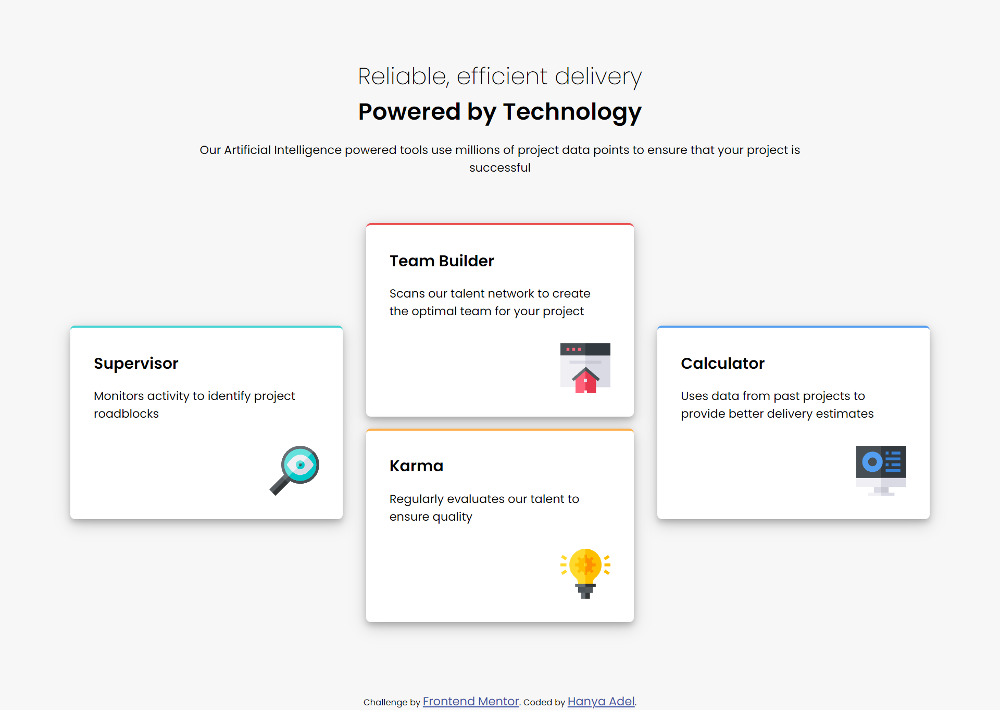
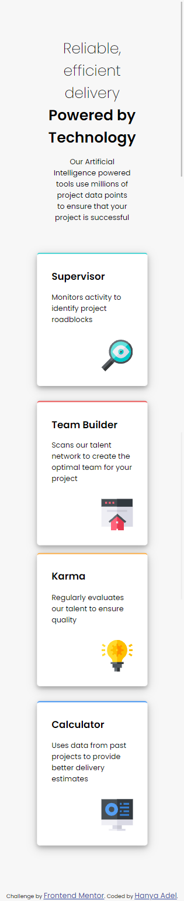

# Frontend Mentor - Four Card Feature Section solution

This is a solution to the [Four Card Feature Section on Frontend Mentor](https://www.frontendmentor.io/challenges/four-card-feature-section-weK1eFYK).

## Table of contents

- [Overview](#overview)
  - [The challenge](#the-challenge)
  - [Screenshot](#screenshot)
  - [Links](#links)
- [My process](#my-process)
  - [Built with](#built-with)
- [Author](#author)

## Overview

### The challenge

Users should be able to:

- View the optimal layout for the component depending on their device's screen size

### Screenshot

Desktop Layout 

Mobile Layout  

### Links

- Solution URL: <a href="https://github.com/HanyaAdel/Four-card-feature-section" target="_new"> Github repository</a>
- Live Site URL: <a href=" https://hanyaadel.github.io/Four-card-feature-section/" target="_new"> Demo</a>

## My process

### Built with

- HTML5 markup
- CSS
- Flexbox

## Author

- Linkedin - [Hanya Adel](https://www.linkedin.com/in/hanya-e-720149138/)
